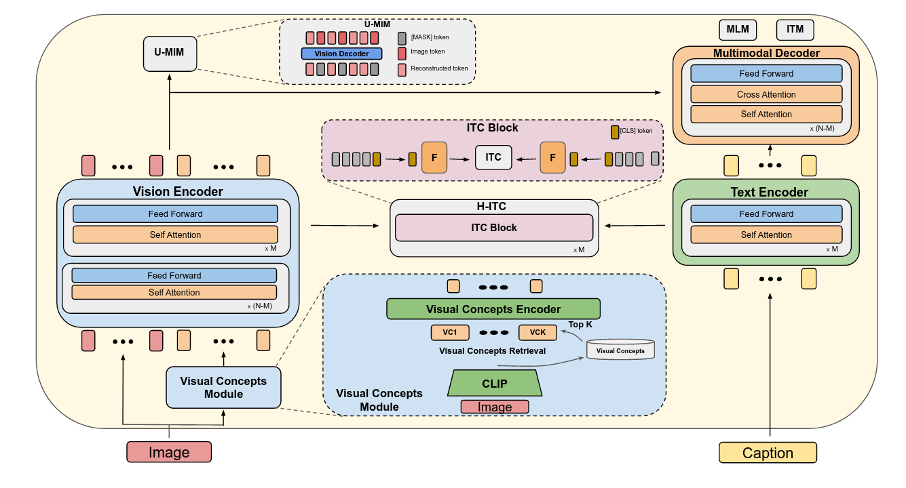
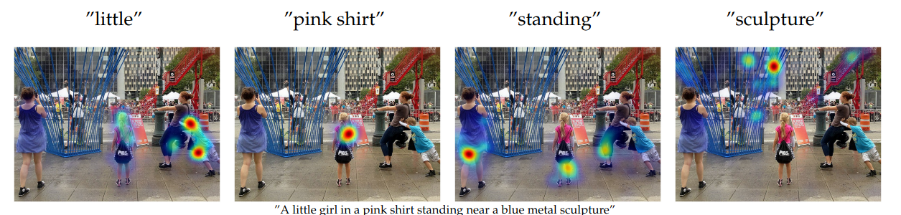

# ViCHA: Efficient Vision-Language Pretraining with Visual Concepts and Hierarchical Alignment.

This is the official PyTorch implementation of the <a href="https://arxiv.org/abs/2208.13628">ViCHA paper</a> 



> Vision and Language Pretraining has become the prevalent approach for tackling multimodal downstream tasks. The current trend is to move towards ever larger models and pretraining datasets. This computational headlong rush does not seem reasonable in the long term to move toward sustainable solutions, and de facto excludes academic laboratories with limited resources. In this work, we propose a new framework, dubbed ViCHA, that efficiently exploits the input data to boost the learning by: (a) a new hierarchical cross-modal alignment loss, (b) new self-supervised scheme based on masked image modeling, (c) leveraging image-level annotations, called Visual Concepts, obtained with existing foundation models such as CLIP to boost the performance of the image encoder. Although pretrained on four times less data, our ViCHA strategy outperforms other approaches on several downstream tasks such as Image-Text Retrieval, VQA, Visual Reasoning, Visual Entailment and Visual Grounding.


### Requirements:
* pytorch 1.8.2
* transformers 4.8.1
* timm 0.4.9
* clip

### Installation:

Create conda env from envs/env.yaml:
```
conda env create -n vicha --file envs/env.yaml
conda activate vicha
```
Then install clip:
```
pip install git+https://github.com/openai/CLIP.git
```

### Download:

#### Model weights
* Pre-trained checkpoint [[1M](https://data.isir.upmc.fr/vicha/pretrained_models/1m_models/pretrain/checkpoint_last.pth)] / [[4M](https://data.isir.upmc.fr/vicha/pretrained_models/4m_models/pretrain/checkpoint_last.pth)]
* Finetuned checkpoint for retrieval on MSCOCO [1M](https://data.isir.upmc.fr/vicha/pretrained_models/1m_models/coco/checkpoint_best.pth) / [[4M](https://data.isir.upmc.fr/vicha/pretrained_models/4m_models/coco/checkpoint_best.pth)]
* Finetuned checkpoint for retrieval on Flickr30k [1M](https://data.isir.upmc.fr/vicha/pretrained_models/1m_models/flickr/checkpoint_best.pth) / [[4M](https://data.isir.upmc.fr/vicha/pretrained_models/4m_models/flickr/checkpoint_best.pth)]
* Finetuned checkpoint for VQA [1M](https://data.isir.upmc.fr/vicha/pretrained_models/1m_models/vqa/checkpoint_last.pth) / [[4M](https://data.isir.upmc.fr/vicha/pretrained_models/4m_models/vqa/checkpoint_last.pth)]
* Finetuned checkpoint for  NLVR2 [1M](https://data.isir.upmc.fr/vicha/pretrained_models/1m_models/nlvr/checkpoint_best.pth) / [[4M](https://data.isir.upmc.fr/vicha/pretrained_models/4m_models/nlvr/checkpoint_best.pth)]
* Finetuned checkpoint for visual entailment on SNLI-VE [1M](https://data.isir.upmc.fr/vicha/pretrained_models/1m_models/ve/checkpoint_best.pth) / [[4M](https://data.isir.upmc.fr/vicha/pretrained_models/4m_models/ve/checkpoint_best.pth)]
* Finetuned checkpoint for visual grounding on RefCOCO+  [1M](https://data.isir.upmc.fr/vicha/pretrained_models/1m_models/grounding/checkpoint_best.pth)


### Dataset

You need to donwnload the dataset from their original websites. Our data directory is structured as follows:
```
path_to_data_dir/

------coco:
            karpathy   v2_mscoco_train2014_annotations.json         v2_OpenEnded_mscoco_test-dev2015_questions.json  val2014
            test2015   v2_mscoco_val2014_annotations.json           v2_OpenEnded_mscoco_train2014_questions.json
            train2014  v2_OpenEnded_mscoco_test2015_questions.json  v2_OpenEnded_mscoco_val2014_questions.json

------sbu:
            annot.json  dataset  images_train

------visual_genome:
            annotations
            images: 
                  VG_100K  VG_100K_2

------cc3m:
            cc3m.json  train  Train_GCC-training.tsv  val  Validation_GCC-1.1.0-Validation.tsv

------flicker30k:
            flickr30k-images  karpathy

------snli:
            data:
                  features  flickr30k_images  images  results_20130124.token  results.tsv  snli_1.0

------nlvr:
            dev  images  nlvr  nlvr2  README.md  test1
```

#### Create augmented datasets (with VCs):

We provide the necessary scripts to extract, embedd and find the best visual concepts for each image (and you can donwnload them as described later):

1. Extract the textual VCs from all the captions of the datasets: extract_keywords.py
2. Embedd all textual VCs using CLIP text encoder: save_kwords_embeddings.py
3. Embedd all images using CLIP visual encoder: save_image_embeddings.py
4. Create the augmented dataset using: create_clip_da_captions_from_saved.py (if you don't have enough memory use create_clip_da_captions.py)

#### Create CLIP-Filtered dataset (800K images)

ViCHA (800K) is trained on; 100% of COCO, 50% of VG captions for each image (we keep all images), and 70% of SBU:
1. To filter the dataset while keeping the same number of images (useful in case of Visual Genome dataset): filter_dataset_per_image.py
2. To filter a given dataset and keeping a percentage of pairs: filter_dataset_percentage.py


#### Download
You can either create the augmented dataset as described above, or download them as follows;
* <a href="https://data.isir.upmc.fr/vicha/data_json/data/"> Dataset json files (with VCs) for downstream tasks</a>
* <a href="https://data.isir.upmc.fr/vicha/data_json/json_pretrain/"> Dataset json files (with VCs) for pre-training</a> (the image paths in each json file need to be changed to your own directory)


### Pretraining
Launch Pretraining on 1M images using 4 GPUs:
```
python -m torch.distributed.launch --nproc_per_node=4 --use_env Pretrain.py \
--config ./configs/Pretrain.yaml --output_dir path_to_log_dir/pretrain \
--data_dir path_to_data_dir --data_json_dir path_to_json_dir/json_pretrain 
```

* `path_to_log_dir`: the directory where you save the logs and model weights
* `path_to_data_dir`: the path to the pretraining dataset (VG, COCO, SBU, CC3M)
* `path_to_json_dir`: the path to datasets json (caption, path to image, VCs...)

you can resume the training or start from a checkpoint using `--resume` and `--checkpoint` arguments.

### Finetuning

#### Retreival
1. Download MSCOCO or Flickr30k datasets from the original websites.
2. Download and extract the provided dataset json files.
3. Finetune the pre-trained checkpoint using 4 A100 GPUs:

For Flickr30K:
```
python -m torch.distributed.launch --nproc_per_node=4 --use_env Retrieval.py \
--config ./configs/Retrieval_flickr.yaml --output_dir path_to_log_dir/retrieval_flickr \
--data_dir path_to_data_dir --data_json_dir path_to_json_dir/data \
--checkpoint path_to_log_dir/pretrain/checkpoint_last.pth 
```
For COCO:
```
python -m torch.distributed.launch --nproc_per_node=4 --use_env Retrieval.py \
--config ./configs/Retrieval_coco.yaml --output_dir path_to_log_dir/retrieval_coco \
--data_dir path_to_data_dir --data_json_dir path_to_json_dir/data \
--checkpoint path_to_log_dir/pretrain/checkpoint_last.pth 
```
4. Evaluate by adding the `--evaluate` arg and using the finetuned checkpoint.

#### VQA

1. Download VQA v2 dataset and Visual Genome dataset from the original websites.
2. Download and extract the provided dataset json files.
3. Finetune the pre-trained checkpoint using 2 A100 GPUs:
```
python -m torch.distributed.launch --nproc_per_node=2 --use_env VQA.py \
--config ./configs/VQA.yaml --output_dir path_to_log_dir/vqa \
--data_dir path_to_data_dir --data_json_dir path_to_json_dir/data \
--checkpoint path_to_log_dir/pretrain/checkpoint_last.pth 
```
4. Evaluate on the VQA v2 [server](https://eval.ai/web/challenges/challenge-page/830/my-submission)

#### SNLI-VE
1. Download SNLI-VE dataset from the original website.
2. Download and extract the provided dataset json files.
3. Finetune the pre-trained checkpoint using 2 A100 GPUs:
```
python -m torch.distributed.launch --nproc_per_node=2 --use_env VE.py \
--config ./configs/VE.yaml --output_dir path_to_log_dir/ve \
--data_dir path_to_data_dir --data_json_dir path_to_json_dir/data \
--checkpoint path_to_log_dir/pretrain/checkpoint_last.pth 
```
4. Evaluate by adding the `--evaluate` arg and using the finetuned checkpoint.

#### NLVR

1. Download SNLI-VE dataset from the original website.
2. Download and extract the provided dataset json files.
3. Pretrain with text-assignment (TA):

```
python -m torch.distributed.launch --nproc_per_node=2 --use_env Pretrain_nlvr.py \
--config ./configs/NLVR_pretrain.yaml --output_dir path_to_log_dir/nlvr_pretrain \
--data_dir path_to_data_dir --data_json_dir path_to_json_dir/json_pretrain \
--checkpoint path_to_log_dir/pretrain/checkpoint_last.pth 
```
4. Finetune the pre-trained checkpoint using 2 A100 GPUs:
```
python -m torch.distributed.launch --nproc_per_node=2 --use_env NLVR.py \
--config ./configs/NLVR.yaml --output_dir path_to_log_dir/nlvr\
--data_dir path_to_data_dir --data_json_dir path_to_json_dir/data \
--checkpoint path_to_log_dir/nlvr_pretrain/checkpoint_last.pth 
```
5. Evaluate by adding the `--evaluate` arg and using the finetuned checkpoint.

#### Grounding
1. Download MSCOCO dataset from the original website.
2. Download and extract the provided dataset json files.
3. Finetune the pre-trained checkpoint using 2 A100 GPUs:
```
python -m torch.distributed.launch --nproc_per_node=2 --use_env Grounding.py \
--config ./configs/Grounding.yaml --output_dir path_to_log_dir/grounding \
--data_dir path_to_data_dir --data_json_dir path_to_json_dir/data \
--checkpoint path_to_log_dir/pretrain/checkpoint_last.pth 
```
4. Evaluate by adding the `--evaluate` arg and using the finetuned checkpoint.


### Visualization:
You can visualize the Grounding results using the `visualization.ipynb` notebook.



 
### Citation.
<pre>
@article{shukor2022efficient,
  title={Efficient Vision-Language Pretraining with Visual Concepts and Hierarchical Alignment},
  author={Shukor, Mustafa and Couairon, Guillaume and Cord, Matthieu},
  journal={arXiv preprint arXiv:2208.13628},
  year={2022}
}
</pre>
